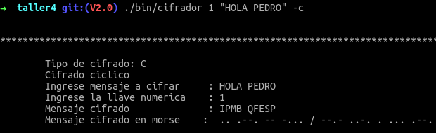
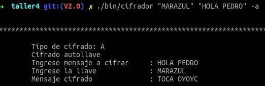
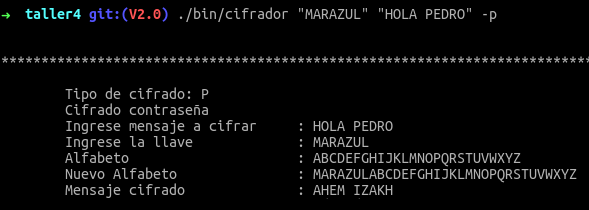

# Taller 4 - Programación de sistemas

## Integrantes
* Bosco Armando Andrade Bravo

* Israel Cano Guerrero

* Joel Eduardo Rodriguez Llamuca

## Instrucciones

## Compilado
Ejecutar make en la carpeta root de proyecto

```sh
$ make
```

Esto generara el ejecutable.

## Ejecutado Programa
Para ejecutarlo solo hacer:

```sh
$ ./bin/cifrador
```


## Opciones de ejecutado

### Cifrado cíclico

_argumentos permitidos_

| número cifrado | palabra a cifrar | opción de cifrar |
|:---------------|:-----------------|:-----------------|
| número         | String           | -c               |

```sh
./bin/cifrador 3 "hola pedro" -c
```

_salida_



### Cifrado autollave

_argumentos permitidos_

| palabra contraseña | palabra a cifrar | opción de cifrar |
|:------------------|:-----------------|:-----------------|
| String            | String           | -a               |

```sh
$ ./bin/cifrador "MARAZUL" "HOLA PEDRO" -a
```

_salida_




### Cifrado contraseña

| palaba contraseña | mensaje a cifrar | opción de cifrar |
|:------------------|:-----------------|:-----------------|
| String            | String           | -p               |

```sh
$ ./bin/cifrador "MARAZUL" "HOLA PEDRO" -p
```
_salida_




# Otros

Los archivos gulpfile.js, package.json y yarn.lock son para autoejecutado de make cuando cambia un archivo
